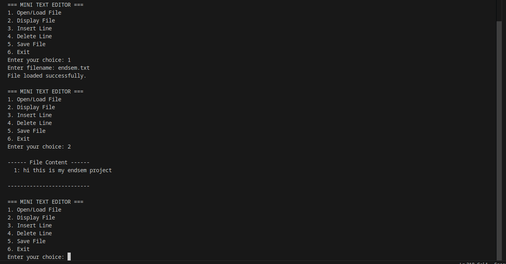

## C PROJECT BY:
### [ADITYA MISHRA ,    590020219, B-78] 
### [SHASHWAT AGRAWAL , 590029107, B-78]
*************************************************************************
### 1. Project Title & Aim
### Title:
### Mini Text Editor Using C
### Aim:
##### To design and implement a console-based mini text editor in C that can create, view, edit (insert/delete lines), and save text files using C programming fundamentals, arrays, functions, structures, pointers, file handling, dynamic memory allocation, preprocessor macros, and the concept of static and shared libraries.
*************************************************************************
### 2. Objectives:

##### 1)Use structures and pointers to represent a text buffer.

##### 2)Use dynamic arrays with `malloc`, `realloc`, and `free` to store file lines.

##### 3)Perform file operations like open, read, write, and close using `fopen`, `fgets`, `fputs`, `fclose`.

##### 4)Implement modular programming using multiple functions.

##### 5)Use preprocessor directives and macros for constants and header guards.

##### 6)Demonstrate how the project can be extended to use static and shared libraries.
*************************************************************************
### 3. Step-by-Step Process 

##### You can write this as “Methodology / Step-by-step procedure”:

##### Step 1: Problem Understanding

##### We want a simple text editor that works in the terminal.

##### The user should be able to:

###### * Open an existing text file

###### * Display file contents

###### * Insert a new line at any position

###### * Delete a line

###### * Save the file

###### * Exit safely

##### Step 2: Decide Data Structure
#####  * Use a structure to store the file content in memory:
```
typedef struct {
    char **lines;      // dynamic array of strings
    int line_count;    // total lines
    int capacity;      // allocated capacity
    char filename[256];// current file name
} TextBuffer;
```
##### * Each line is a `char*` (string).

##### * `lines` is a dynamic array allocated using `malloc` / `realloc`.


##### Step 3: Design Main Features as Functions

###### `init_buffer()` – initialize TextBuffer.

###### `free_buffer()` – free all allocated memory.

###### `display_buffer()` – print all lines with line numbers.

###### `insert_line()` – insert a new line at a given position.

###### `delete_line()` – delete a line at a given position.

###### `load_file()` – read from a text file into the buffer.

###### `save_file()` – write from buffer to file.

###### `ensure_capacity()` – increase capacity using realloc.

###### `clear_input_buffer()` – flush extra input characters.

##### Step 4: Menu-Driven Main Program

##### * Use an infinite while(1) loop with a menu:

###### 1)Open/Load File

###### 2)Display File

###### 3)Insert Line

###### 4)Delete Line

###### 5)Save File

###### 6)Exit

##### * Take user choice with scanf, call the respective function.


##### Step 5: Add File Handling

##### In `load_file():`

######  * Open file using `fopen(filename, "r").`

######  * Read each line using `fgets.`

######  * Insert each line into `TextBuffer`.

##### In `save_file():`

###### * Open file using `fopen`(filename, "w").

###### * Write each line using `fputs.`

##### Step 6: Add Dynamic Memory Management

###### * Allocate initial memory with `malloc`(INITIAL_CAPACITY * sizeof(char *)).

###### * When the number of lines reaches capacity, double it using `realloc`.

###### * For each new line, allocate exact memory for the string using malloc(strlen(line)+1).

###### * On exit, free every line and then free the lines array.

##### Step 7: Use Preprocessor & Macros

###### * Use #define MAX_LINE_LEN 256.

###### * Use #define INITIAL_CAPACITY 10.

###### * Use header guards in header files (when you split it later):
```
#ifndef EDITOR_H
#define EDITOR_H
...
#endif
```
##### Step 8: Static & Shared Libraries

###### Move text utilities (like count words, count characters) into `text_utils.c` and create a static library libtextutils.a.

###### Move file operations (load_file, save_file) into file_ops.c and create a shared library `libfileops.so`.

###### Link these libraries in your main program using gcc link flags `(-L. -ltextutils -lfileops)`.
*************************************************************************

### 4. Algorithm 
##### You can write this in your record under “Algorithm”:

##### 1)Start.

##### 2)Initialize a TextBuffer using init_buffer().

##### 3)Repeat the following steps until user chooses Exit:
##### a. Display the menu options.
##### b. Read user choice.
##### c. If choice is Open/Load File:

###### * Ask for filename.

###### * Clear previous buffer.

###### * Call load_file().
##### d. If choice is Display File:

###### * Call display_buffer().
##### e. If choice is Insert Line:

###### * Ask for position and new text line.

###### * Call insert_line().
##### f. If choice is Delete Line:

###### * Ask for line number.

###### * Call delete_line().
##### g. If choice is Save File:

###### * Call save_file().
##### h. If choice is Exit:

###### * Call free_buffer() to release all memory.

##### Terminate program.

##### Stop.
*************************************************************************

### 5. Implementation 
##### You can put this as “Program” in your notebook.
```
#include <stdio.h>
#include <stdlib.h>
#include <string.h>

#define MAX_LINE_LEN 256
#define INITIAL_CAPACITY 10

typedef struct {
    char **lines;      // dynamic array of strings
    int line_count;
    int capacity;
    char filename[256];
} TextBuffer;

void init_buffer(TextBuffer *buf) {
    buf->lines = (char **)malloc(INITIAL_CAPACITY * sizeof(char *));
    if (!buf->lines) {
        printf("Memory allocation failed!\n");
        exit(1);
    }
    buf->line_count = 0;
    buf->capacity = INITIAL_CAPACITY;
    buf->filename[0] = '\0';
}

void ensure_capacity(TextBuffer *buf) {
    if (buf->line_count >= buf->capacity) {
        int new_cap = buf->capacity * 2;
        char **new_lines = (char **)realloc(buf->lines, new_cap * sizeof(char *));
        if (!new_lines) {
            printf("Realloc failed!\n");
            exit(1);
        }
        buf->lines = new_lines;
        buf->capacity = new_cap;
    }
}

void free_buffer(TextBuffer *buf) {
    for (int i = 0; i < buf->line_count; i++) {
        free(buf->lines[i]);
    }
    free(buf->lines);
    buf->lines = NULL;
    buf->line_count = 0;
    buf->capacity = 0;
}

void display_buffer(const TextBuffer *buf) {
    if (buf->line_count == 0) {
        printf("\n[File is empty]\n");
        return;
    }
    printf("\n------ File Content ------\n");
    for (int i = 0; i < buf->line_count; i++) {
        printf("%3d: %s", i + 1, buf->lines[i]);
    }
    printf("\n--------------------------\n");
}

void insert_line(TextBuffer *buf, const char *line, int position) {
    if (position < 1 || position > buf->line_count + 1) {
        printf("Invalid position!\n");
        return;
    }
    ensure_capacity(buf);

    // shift lines down from position-1
    for (int i = buf->line_count; i >= position; i--) {
        buf->lines[i] = buf->lines[i - 1];
    }

    buf->lines[position - 1] = (char *)malloc(strlen(line) + 1);
    if (!buf->lines[position - 1]) {
        printf("Memory allocation failed!\n");
        return;
    }
    strcpy(buf->lines[position - 1], line);
    buf->line_count++;
}

void delete_line(TextBuffer *buf, int position) {
    if (position < 1 || position > buf->line_count) {
        printf("Invalid position!\n");
        return;
    }

    free(buf->lines[position - 1]);

    for (int i = position - 1; i < buf->line_count - 1; i++) {
        buf->lines[i] = buf->lines[i + 1];
    }

    buf->line_count--;
}

void load_file(TextBuffer *buf, const char *filename) {
    FILE *fp = fopen(filename, "r");
    if (!fp) {
        printf("File not found. New file will be created on save.\n");
        strcpy(buf->filename, filename);
        return;
    }

    strcpy(buf->filename, filename);
    char temp[MAX_LINE_LEN];

    while (fgets(temp, sizeof(temp), fp)) {
        insert_line(buf, temp, buf->line_count + 1);
    }

    fclose(fp);
    printf("File loaded successfully.\n");
}

void save_file(TextBuffer *buf) {
    if (buf->filename[0] == '\0') {
        printf("Enter filename to save: ");
        scanf("%255s", buf->filename);
    }

    FILE *fp = fopen(buf->filename, "w");
    if (!fp) {
        printf("Error opening file for writing!\n");
        return;
    }

    for (int i = 0; i < buf->line_count; i++) {
        fputs(buf->lines[i], fp);
    }

    fclose(fp);
    printf("File saved as %s\n", buf->filename);
}

void clear_input_buffer() {
    int c;
    while ((c = getchar()) != '\n' && c != EOF) {
        // discard
    }
}

int main() {
    TextBuffer buf;
    init_buffer(&buf);

    int choice;
    char filename[256];
    char line[MAX_LINE_LEN];
    int pos;

    while (1) {
        printf("\n=== MINI TEXT EDITOR ===\n");
        printf("1. Open/Load File\n");
        printf("2. Display File\n");
        printf("3. Insert Line\n");
        printf("4. Delete Line\n");
        printf("5. Save File\n");
        printf("6. Exit\n");
        printf("Enter your choice: ");
        if (scanf("%d", &choice) != 1) {
            printf("Invalid input!\n");
            clear_input_buffer();
            continue;
        }

        clear_input_buffer(); // clear leftover newline

        switch (choice) {
            case 1:
                printf("Enter filename: ");
                scanf("%255s", filename);
                clear_input_buffer();
                free_buffer(&buf);  // free old content
                init_buffer(&buf);  // re-init
                load_file(&buf, filename);
                break;

            case 2:
                display_buffer(&buf);
                break;

            case 3:
                printf("Enter position to insert (1 to %d): ", buf.line_count + 1);
                scanf("%d", &pos);
                clear_input_buffer();
                printf("Enter text: ");
                if (fgets(line, sizeof(line), stdin) == NULL) {
                    printf("Error reading line.\n");
                    break;
                }
                insert_line(&buf, line, pos);
                break;

            case 4:
                printf("Enter line number to delete (1 to %d): ", buf.line_count);
                scanf("%d", &pos);
                clear_input_buffer();
                delete_line(&buf, pos);
                break;

            case 5:
                save_file(&buf);
                break;

            case 6:
                free_buffer(&buf);
                printf("Exiting...\n");
                return 0;

            default:
                printf("Invalid choice! Try again.\n");
        }
    }

    return 0;
}
```
*************************************************************************
### Compile and run:
```
gcc main.c -o text_editor
./text_editor
```
*************************************************************************
### Project Explanation

#### Mini Text Editor in C

##### This project is a console-based mini text editor that allows the user to open a text file, display its contents, insert a new line at any position, delete an existing line, and save the file back to disk. The file contents are temporarily stored in memory so that multiple edits can be done before saving.
##### The core data structure used is a struct TextBuffer, which contains a dynamic array of strings (char **lines), along with the current number of lines, capacity, and filename. Dynamic memory allocation (malloc, realloc, free) is used to manage the lines, so the editor can handle files of varying sizes instead of being limited to a fixed array size.
##### File handling is done using standard C library functions like fopen, fgets, fputs, and fclose. The program reads the file line by line into memory and writes it back line by line on saving. Pointers are used extensively: pointers to characters for strings, pointers to dynamic arrays, and pointers passed to functions (call by reference) to modify the text buffer. Preprocessor macros (#define) are used to define constants like maximum line length and initial capacity, making the code easier to change and maintain. The project can also be extended by moving text utility and file-handling functions into static and shared libraries to demonstrate modular programming and code reuse.
*************************************************************************
### Flowchart:
#### A) Flowchart for `load_file()`

#### Aim: To load the contents of a text file into the text buffer.

#### Steps :

##### 1.Start

##### 2.Input `filename`.

##### 3.Call `fopen(filename, "r")`.

##### 4.Decision: Is fp == NULL?

#####  * Yes:

###### * Print “File not found. New file will be created on save.”

###### * Copy `filename` into `buf->filename.`

###### * Go to Step 10.

#####  * No:

###### * Copy `filename` into `buf->filename`.

##### 5.Read one line from file using fgets(temp, MAX_LINE_LEN, fp).

##### 6.Decision: Is `fgets` successful? (not NULL)

##### Yes:

###### * Call insert_line(buf, temp, buf->line_count + 1).

###### * Go back to Step 5.

##### No:

###### * Go to Step 7.

##### 7.Close the file using fclose(fp).

##### 8.Print “File loaded successfully.”

##### 9.Go to Step 10.

##### 10.End
*************************************************************************
#### B)Flowchart for insert_line()

#### Aim:
To insert a new line at a given position in the text buffer.

##### Steps:

1. **Start**

2. **Input** `position` and `line` (text).

3. **Decision:**  
   Is `position < 1` **OR** `position > line_count + 1`?
   - **Yes:**
     - Print **"Invalid position"**
     - Go to **Step 10**
   - **No:** Continue

4. **Decision:**  
   Is `line_count == capacity`?
   - **Yes:**  
     - Call `ensure_capacity()` to increase memory using `realloc`
   - **No:** Continue

5. Set `i = line_count`

6. **While** `i >= position`:
   - Move line:  
     `lines[i] = lines[i - 1]`
   - Decrement `i`

7. Allocate memory for new line using:  
   `malloc(strlen(line) + 1)`

8. Copy the text into new position:  
   `strcpy(lines[position - 1], line)`

9. Increment `line_count`

10. **End**
*************************************************************************
####  C)Flowchart for delete_line()

####  Aim:
To delete a line from a given position in the text buffer.

##### Steps:

1. **Start**

2. **Input** `position`.

3. **Decision:**  
   Is `position < 1` **OR** `position > line_count`?
   - **Yes:**
     - Print **"Invalid position"**
     - Go to **Step 9**
   - **No:** Continue

4. Free memory of the line at:  
   `free(lines[position - 1])`

5. Set `i = position - 1`

6. **While** `i < line_count - 1`:
   - Shift line upward:  
     `lines[i] = lines[i + 1]`
   - Increment `i`

7. Decrement `line_count`

8. *(Optional)* Print **"Line deleted successfully"**

9. **End**
*************************************************************************
####  D)Flowchart for save_file()

#### Aim:
To save the contents of the text buffer into a text file.

##### Steps:

1. **Start**

2. **Decision:**  
   Is `buf->filename[0] == '\0'`? (Is filename empty?)
   - **Yes:**
     - Ask user to input a filename
     - Store it in `buf->filename`
   - **No:**  
     - Continue

3. Call:  
   `fp = fopen(buf->filename, "w")`

4. **Decision:**  
   Is `fp == NULL`?
   - **Yes:**
     - Print **"Error opening file for writing"**
     - Go to **Step 11**
   - **No:**  
     - Continue

5. Set `i = 0`

6. **While** `i < line_count`:
   - Write line to file:  
     `fputs(lines[i], fp)`
   - Increment `i`

7. Close the file:  
   `fclose(fp)`

8. Print **"File saved successfully"**

9. **End**
*************************************************************************
### Sample Output:




*************************************************************************


